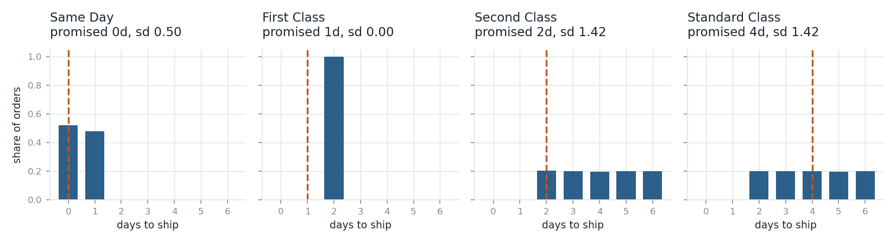
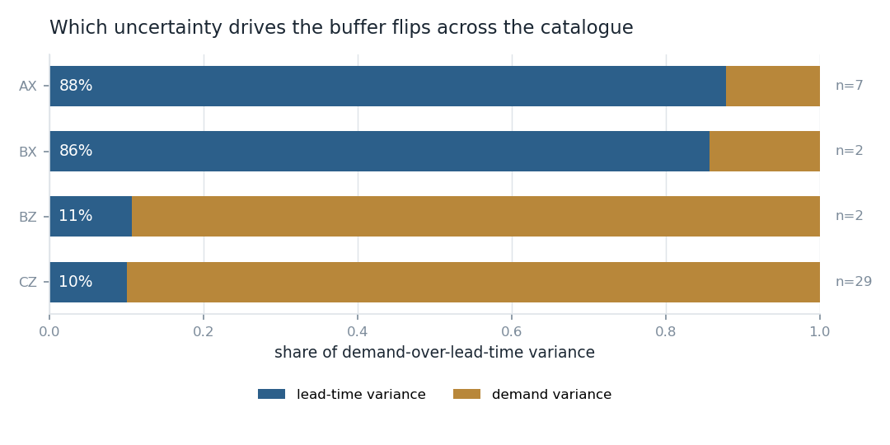
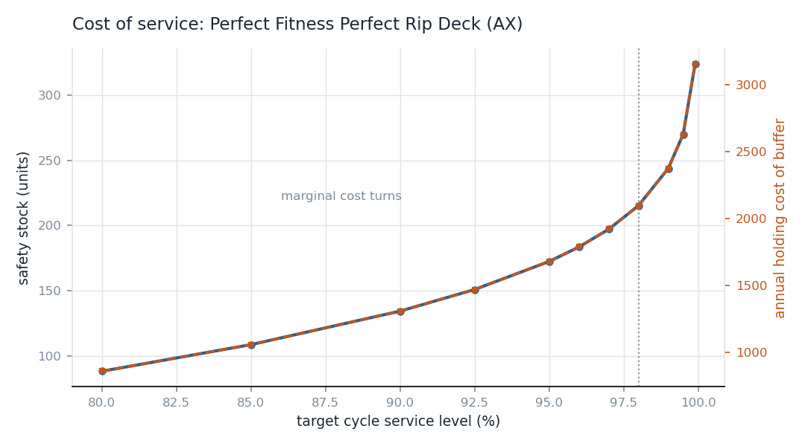
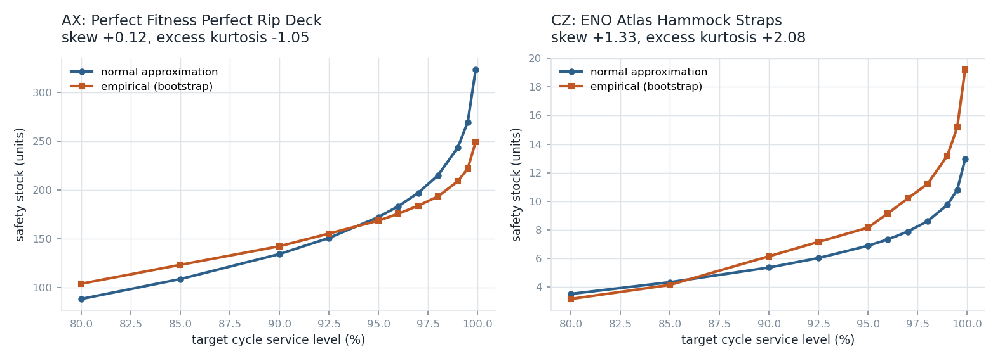
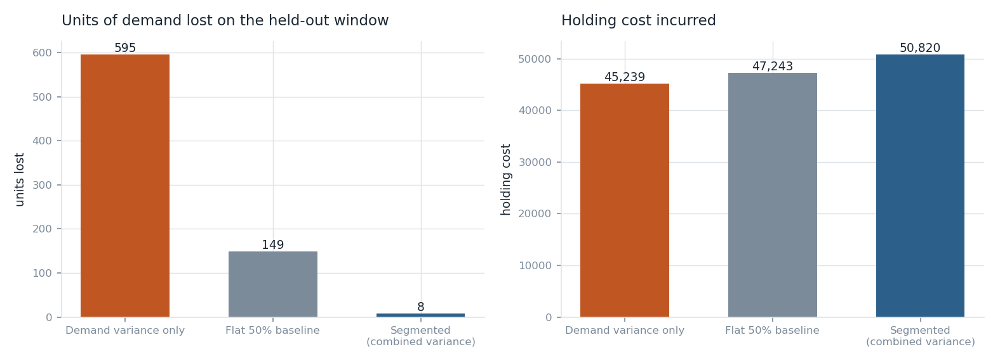

# Inventory Policy Under Demand and Lead-Time Uncertainty

I built a single-echelon inventory policy (safety stock, reorder point, order quantity) on
the DataCo Smart Supply Chain extract, segmented products by revenue contribution and
demand variability, and backtested the result on a held-out window against two alternative
policies.

I set out to build this around real observed lead-time variability, on the premise that
most inventory exercises assume a fixed lead time and that this dataset supplies a real
one. That premise turned out to be wrong, and finding out why became the most useful part
of the project. The lead-time column in this extract is generated rather than observed. I
kept the project, changed what it claims, and made the audit that established this the
first thing the pipeline does.

## What this demonstrates, and what it does not

It demonstrates that I check whether a dataset supports the claim I want to make before
building on it, that I can implement the combined demand and lead-time variability safety
stock correctly and show which term is actually driving the answer, and that I test a
policy on data the parameters never saw.

It does not demonstrate inventory optimisation against real supplier lead times, because
this dataset does not contain any. Every lead-time number here is a stated proxy, and
every cost parameter is an assumption. Both are flagged wherever they appear. The
[Limitations](#limitations) section is not a footnote, it is the part I would want to be
asked about.

## The audit that changed the design

### The lead-time column is generated

Realised lead time in this extract is a draw conditioned on shipping mode and on nothing
else.



| Shipping mode | Rows | Promised | Realised mean | Realised sd | Support | Uniformity p |
|---|---|---|---|---|---|---|
| Standard Class | 107,752 | 4 days | 3.996 | 1.417 | {2,3,4,5,6} | 0.015 |
| Second Class | 35,216 | 2 days | 3.991 | 1.416 | {2,3,4,5,6} | 0.650 |
| First Class | 27,814 | 1 day | 2.000 | **0.000** | {2} | n/a |
| Same Day | 9,737 | 0 days | 0.478 | 0.500 | {0,1} | 1.8e-05 |

First Class delivers in exactly two days across 27,814 rows with zero variance. Second
Class and Standard Class are statistically indistinguishable from each other (chi-square
4.93 on 4 degrees of freedom, p = 0.295) despite promising two days and four days
respectively, so realised delivery time does not respond to the service level purchased.

Region explains 0.05% of lead-time variance within Standard Class (eta squared 0.000503,
23 regions, 107,752 rows). The one-way test returns p = 0.00016, which is significant and
meaningless: at this row count the test rejects on a spread of 0.39 days against a pooled
standard deviation of 1.42. I report the effect size rather than the p value for exactly
this reason, and the code decides on eta squared.

The consequence is that segmenting the lead-time distribution by region, which was
supposed to be a pillar of this project, recovers nothing. The gap between scheduled and
realised days is also mechanical rather than operational: Standard Class promises four and
draws uniform over two to six, so it runs late 39.8% of the time, while Second Class
promises two and draws from the same law, so it runs late 79.8% of the time.

`Late_delivery_risk` is reproducible from `real > scheduled` in 97.5% of rows, so it is a
derived column and I do not treat it as independent information.

### The extract changes character in October 2017

| | Jan 2015 to Sep 2017 | Oct 2017 to Jan 2018 |
|---|---|---|
| Order lines per month | 5,210 | 2,139 |
| Distinct products per month | 53.5 | 13.0 |
| Share of lines with quantity 1 | ~0.53 | 0.990 |

From November 2017 every order line has quantity exactly one. Of the products appearing
after the boundary, 18 of 31 never appear before it. These are two different data
generating processes, so I cut the modelling window at 2017-09-30 and excluded 8,193 rows.
Pooling across that boundary, or using the tail as a test window, would have produced a
backtest on broken data.

### Markets are time sliced, not concurrent

| Market | Weeks active | Share of 144 weeks | First week | Last week |
|---|---|---|---|---|
| Europe | 60 | 41.7% | 2015-05-25 | 2017-09-25 |
| Pacific Asia | 46 | 31.9% | 2015-10-19 | 2017-01-16 |
| LATAM | 44 | 30.6% | 2014-12-29 | 2017-06-12 |
| USCA | 43 | 29.9% | 2016-03-28 | 2017-01-16 |
| Africa | 22 | 15.3% | 2016-08-22 | 2017-01-16 |

No market is live in even half the weeks. Any product by market weekly series is therefore
zero inflated by construction, and its apparent coefficient of variation (median 1.77) is
mostly the market being switched off. This ruled out product by market as a planning grain
and is why I plan at product level.

### Demand carries no time structure

Aggregate weekly demand across the continuous units has lag-1 autocorrelation of 0.050 and
a maximum absolute autocorrelation of 0.051 across lags 1 to 4. There is no trend, no
seasonality and no persistence. This is a further sign the extract is simulated, and it is
also why the project takes demand statistics from history rather than forecasting them:
there is nothing here for a forecast to find.

## Data

Kaggle `shashwatwork/dataco-smart-supply-chain-for-big-data-analysis`. The file is not
UTF-8 and must be read as `latin-1`.

| Step | Rows |
|---|---|
| Raw extract | 180,519 |
| Excluded, cancelled or suspected fraud | 7,754 |
| Excluded, after the 2017-09-30 boundary | 8,193 |
| Modelling population | 164,572 |

The clean window spans 2015-01-01 to 2017-09-30, 144 weeks, 100 products. The 7,754
cancelled and fraud lines reconcile exactly against the 7,754 rows the extract labels
"Shipping canceled". The ledger is asserted in code and the pipeline fails if the
exclusions do not account for every raw row.

The dataset spans 2015 to early 2018, not 2015 to 2019 as it is often described.

## Demand characterisation

Demand statistics are empirical, not forecast. A week inside a product's active span with
no orders is genuine zero demand and counts. Weeks before a product first appeared or
after it last appeared are not observations and are excluded, since averaging in weeks when
a product was not on the catalogue would understate its mean and overstate its variability.

Of 100 planning units, 46 have too thin a sample to support a variance estimate and 14 are
intermittent (more than 10% zero weeks within their span). The remaining 40 carry the
policy and represent 95.7% of unit demand and 97.1% of revenue.

The policy math runs on a daily time base. Lead time here is measured in whole days over a
support of two to six, so working in days keeps the lead-time distribution exact rather
than forcing a fractional week. Daily demand has complete coverage for every unit carried
forward, no day of week effect (highest weekday mean is 1.018 times the lowest), and a
weekly standard deviation at 0.947 of what independent daily draws would predict.

## Segmentation

ABC by cumulative revenue share (80% / 95% cut points), XYZ by weekly coefficient of
variation (0.25 / 0.50 cut points).

| Segment | Units | Revenue share | Median CV | Service target |
|---|---|---|---|---|
| AX | 7 | 82.45% | 0.105 | 98% |
| BX | 2 | 12.12% | 0.120 | 95% |
| BZ | 3 | 0.54% | 0.704 | 95% |
| CX | 8 | 0.20% | 0.045 | 90% |
| CY | 13 | 0.50% | 0.446 | 90% |
| CZ | 67 | 4.19% | 0.697 | 90% |

The concentration is far more extreme than the textbook 20/80 shape: 7 of 100 units (7%)
carry 80% of revenue, and the top fifth of the catalogue carries 96.1%. Six of nine grid
cells are populated, and the A tier sits entirely in X, so the XYZ axis does no work at the
top of the catalogue. I report that rather than presenting a full 3x3 policy that the data
does not support.

Two populations separate cleanly: nine high-volume units at 91 to 489 units per week with
CV near 0.10, and a tail at roughly 7 units per week with CV near 0.70.

## Policy

Safety stock uses the combined form carrying both sources of uncertainty:

```
SS = z * sqrt(L * sigma_d^2 + d^2 * sigma_L^2)
ROP = d * L + SS
```

Lead-time proxy, Standard Class: 3.994 days mean, 1.419 days standard deviation, CV 0.355.

### Which uncertainty drives the buffer flips across the catalogue



| Segment | Lead-time share of variance | Demand share | Understatement if lead-time variance is dropped |
|---|---|---|---|
| AX | 87.9% | 12.1% | 2.87x |
| BX | 85.7% | 14.3% | 2.78x |
| BZ | 10.7% | 89.3% | 1.06x |
| CZ | 10.1% | 89.9% | 1.05x |

This is the most useful result in the project. On the high-volume units, lead-time
variability accounts for roughly seven eighths of the variance the buffer is sized
against, so the widely quoted demand-only simplification would hold under 35% of the
required safety stock. On the tail the same simplification is nearly exact. A single
blanket approach is wrong in one direction or the other for most of the catalogue.

Because sigma_L is a proxy rather than a measurement, the claim is a range, not a point:

| sigma_L multiplier | sd (days) | Total safety stock | Versus base |
|---|---|---|---|
| 0.00 (fixed lead time) | 0.000 | 484.8 | 0.44x |
| 0.50 | 0.709 | 709.0 | 0.64x |
| 1.00 (proxy value) | 1.419 | 1,108.2 | 1.00x |
| 1.50 | 2.128 | 1,542.7 | 1.39x |
| 2.00 | 2.838 | 1,989.7 | 1.80x |

Assuming a fixed lead time carries 44% of the buffer the variable case requires. That
conclusion holds across the whole plausible range of the proxy, which is what makes it
worth stating despite the proxy being assumed.

### Order quantity

EOQ under the stated cost assumptions. This works on the fast movers (13 to 20 days of
cover for AX) and breaks on the tail, where it returns 158 to 228 days of cover. That is
not a defect in the formula, it is a flat ordering cost of 250 applied across a hundredfold
range of demand rates. A real implementation would tier the ordering cost or impose a
maximum cover constraint. I left it visible rather than quietly capping it.

## Service level against cost



For Perfect Fitness Perfect Rip Deck (AX), moving from 80% to 98% cycle service costs 1,238
per year in extra holding and the marginal cost per service point rises from 40 to 177.
Past 98% it turns sharply: 1,314 per service point at 99.9%.

One property of this curve is worth stating plainly. Safety stock is proportional to the
normal quantile of the target and holding cost is proportional to safety stock, so the
marginal cost curve has the same shape for every unit and differs only by a scale factor.
The knee therefore lands at 98% for every unit and **cannot** justify giving one segment a
different target from another. What justifies differentiation is the cost of the buffer
against the revenue it protects:

| Segment | Target | Buffer cost per 1,000 of revenue protected | Median days of cover |
|---|---|---|---|
| AX | 98% | 1.38 | 17.9 |
| BX | 95% | 1.12 | 25.3 |
| BZ | 95% | 3.17 | 135.9 |
| CZ | 90% | 2.55 | 227.6 |

The erratic segments cost roughly two to three times more per unit of revenue protected
even at lower service targets. That gap, not the shape of the cost curve, is the argument
for a tiered policy.

### The normal approximation errs in opposite directions



I compared the closed form against a bootstrap of the observed demand-over-lead-time
distribution (20,000 draws, lead times resampled from the empirical mass function).

| Segment | Skew | Excess kurtosis | Normal / empirical at 95% | at 98% | at 99.9% |
|---|---|---|---|---|---|
| AX | +0.12 | -1.05 | 1.02 | 1.11 | 1.30 |
| CZ | +1.34 | +2.08 | 0.85 | 0.77 | 0.67 |

On AX the closed form over-buffers by 30% at the top of the range, because demand over lead
time is flat topped rather than bell shaped. On CZ it under-buffers by 33%, because
zero-inflated demand makes the distribution right skewed.

The AX flat-topped shape is inherited directly from the generated uniform lead time. If
real lead times were lognormal, as replenishment lead times usually are, this error would
run the other way. I would not carry the AX half of this finding into a real system without
re-deriving it on real lead-time data. The CZ half, driven by demand intermittency rather
than by the lead-time artefact, would hold.

## Backtest

Policy parameters are estimated on 2015-01-01 to 2016-12-24 (724 days) and simulated on
2016-12-25 to 2017-09-30 (280 days, first 30 excluded as warmup). The test window is never
seen by the fitting step.

Continuous review (s, Q), daily steps, unmet demand lost rather than backordered. Lead
times are drawn from the empirical mass function, and the same draws are reused across all
three policies so no policy can win on a luckier sequence of deliveries.



| Policy | Fill rate | Realised cycle service | Safety stock | Holding cost | Units lost |
|---|---|---|---|---|---|
| Segmented (combined variance) | 99.990% | 97.89% | 1,122.2 | 50,820 | 8.0 |
| Demand variance only | 99.267% | 82.01% | 494.5 | 45,239 | 595.4 |
| Flat 50% baseline | 99.817% | 90.07% | 695.0 | 47,243 | 148.9 |

The demand-only policy reaches 82.0% realised cycle service against stated targets of 90%
to 98%. It does not merely underperform, it misses its own target by a wide margin, which
is the practical cost of dropping the lead-time variance term. The segmented policy lands
at 97.89% against an effective target of 98% on the units that drive the aggregate.

The segmented policy costs 6,331 more in total over the window and avoids 587 lost units.

Split by segment, the advantage is exactly where the variance decomposition predicted:

| Segment | Policy | Fill rate | Cycle service | Units lost |
|---|---|---|---|---|
| AX | Segmented | 100.00% | 100.0% | 0.0 |
| AX | Demand only | 99.28% | 85.2% | 470.6 |
| AX | Flat baseline | 99.83% | 93.2% | 112.9 |
| CZ | Segmented | 99.75% | not estimable | 6.3 |
| CZ | Demand only | 99.72% | not estimable | 7.0 |
| CZ | Flat baseline | 99.39% | not estimable | 15.5 |

On CZ the segmented and demand-only policies are almost identical, which is what should
happen when the lead-time term is only 10% of variance there. The simulation confirms the
mechanism, not just the outcome.

Cycle service level is suppressed for BX, BZ and CZ. Those segments complete 0.55 to 1.0
replenishment cycles per unit over the test window, far below the 30 cycles the code
requires before reporting a proportion. Fill rate is the reliable service measure for slow
movers here.

## Cost assumptions

None of these are observed. The extract carries selling prices and revenue and no cost
structure at all. They live in `config/config.yaml`.

| Parameter | Value | Basis |
|---|---|---|
| Annual holding rate | 25% of unit cost | Conventional planning figure |
| Ordering cost | 250 per order | Assumed |
| Unit cost | 65% of selling price | Assumed gross margin of 35% |
| Stockout penalty | Not modelled | No basis in the data |

Because there is no stockout cost, this project cannot compute an optimal service level. It
can show what each level costs and where the curve turns, which is why the recommendation
is framed as a tradeoff rather than an optimum.

## Limitations

**The lead time is a proxy for a quantity the data does not contain.** Safety stock needs
replenishment lead time, supplier to warehouse. This extract has outbound fulfilment time,
order to customer. There is no supplier, purchase order or receipt anywhere in the file. I
use the outbound distribution as a stated substitute. The method is unchanged, the
parameter source is a substitution, and every lead-time object in the code carries an
`is_proxy` flag and a source string so this cannot be lost downstream.

**The proxy is itself generated.** Documented in full above. It is a uniform draw keyed on
shipping mode. This is why sigma_L is swept rather than fitted.

**The demand series are almost certainly simulated too.** CV near 0.10 at product level,
zero autocorrelation at every lag, no seasonality, and a tail whose weekly means cluster
tightly around 7. Real retail demand does not look like this. The policy math is unaffected,
but nobody should read the specific safety stock numbers as being about a real business.

**Single echelon by construction.** There is no distribution centre or warehouse field in
the extract, so there is no network to optimise across even if I wanted to.

**ABC is degenerate at the top.** Seven units carry 80% of revenue and all seven are X
class. The 3x3 grid has six populated cells and the XYZ axis does nothing in the A tier.

**Thin cycle counts on slow movers.** Only AX accumulates enough replenishment cycles in
the test window to support a cycle service estimate.

**One test window, one seed.** The backtest is a single 280 day window with one lead-time
realisation per unit. Common random numbers make the comparison between policies fair, but
they do not turn one window into a distribution of outcomes. A repeated-seed study would
put an interval around these differences and I have not run one.

**EOQ breaks on the tail.** Flat ordering cost across a hundredfold demand range gives the
slow movers 228 days of cover.

## Running it

```bash
pip install -r requirements.txt
```

Set `paths.raw_csv` in `config/config.yaml` to your copy of
`DataCoSupplyChainDataset.csv`, then:

```bash
make all
```

Individual phases:

```bash
make phase1
```

Tests:

```bash
make test
```

130 tests. The audit detectors are tested against both synthetic data they should flag and
synthetic data they should not, since a detector that only ever confirms what I already
believed would be worth nothing.

## Layout

```
config/config.yaml   every parameter and every assumption
src/data_io.py       loading, exclusions, panels
src/audit.py         the data quality tests
src/demand.py        empirical demand statistics
src/leadtime.py      lead-time parameters and provenance
src/segmentation.py  ABC and XYZ
src/policy.py        safety stock, reorder point, EOQ, bootstrap
src/tradeoff.py      service level curves
src/simulate.py      the (s, Q) simulation
src/figures.py       charts
run.py               single entrypoint
reports/             tables, figures and findings, all generated
```

Every number in this README comes from a full pipeline run. None are estimated or carried
over from a previous version.

## Licence

MIT.
